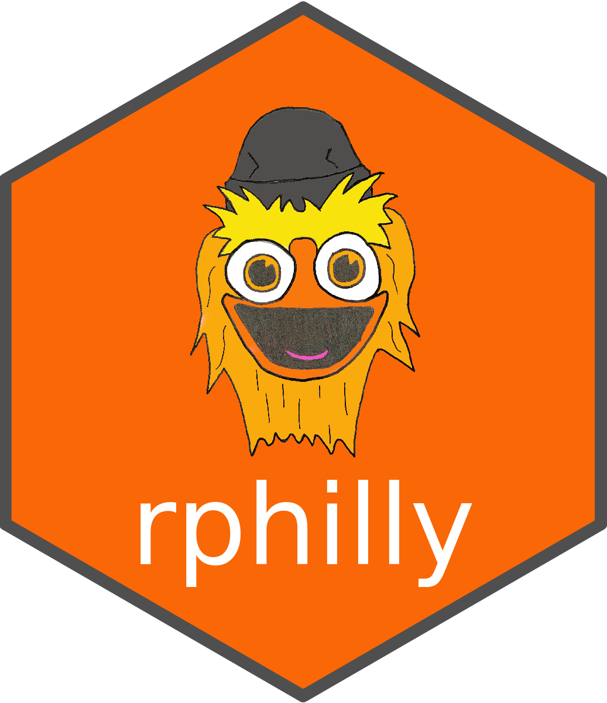

<!-- README.md is generated from README.Rmd. Please edit that file -->

```{r, include = FALSE}
knitr::opts_chunk$set(
  collapse = TRUE,
  comment = "#>",
  fig.path = "man/figures/README-",
  out.width = "100%"
)
```

# rphilly

<!-- badges: start -->
[](https://github.com/rsh52/rphilly/actions)
[](https://codecov.io/gh/rsh52/rphilly?branch=master)
[](https://lifecycle.r-lib.org/articles/stages.html#experimental)
<!-- badges: end -->

```{r, out.width="250px"}



```

The goal of `rphilly` is to provide convenient helper functions and pre-processed datasets from [OpenDataPhilly.org](https://www.opendataphilly.org/). This package is in no way responsible for the actual recording, updating, or contents of the raw datasets. (It also has no relation to the NHL, but we do respect our favorite orange jawn)

## Installation

You can install the development version of `rphilly` from [GitHub](https://github.com/) with:

``` r
# install.packages("devtools")
devtools::install_github("rsh52/rphilly")
```

> This package is still in development.

## `rphilly`: COVID-19

The following functions are available for COVID-19 data extraction, with data supplied from [several datasets](https://www.opendataphilly.org/organization/city-of-philadelphia?q=covid&sort=score+desc%2C+metadata_modified+desc):

- `covid_age`
- `covid_date`
- `covid_gender`
- `covid_outcome`
